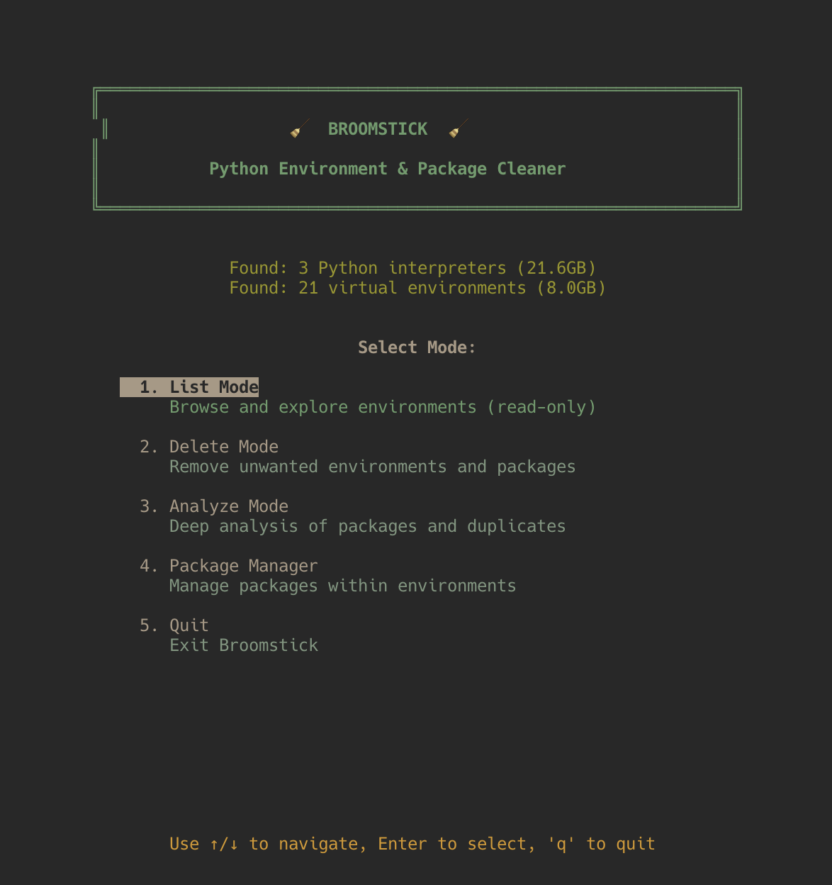

# Broomstick 🧹

A comprehensive, Mole-inspired cleanup tool for Python environments. Discover, analyze, and clean up Python installations, virtual environments, and individual packages across your system with an interactive TUI or powerful CLI.

## ✨ New in Version 2.0

### Mole-Inspired Mode System
- **List Mode**: Browse and explore environments (read-only)
- **Delete Mode**: Remove unwanted environments and packages
- **Analyze Mode**: Deep analysis of packages and duplicates
- **Package Manager**: Manage packages within environments

### Enhanced TUI Features
- **Mode Selection Screen**: Beautiful startup screen with mode chooser
- **Smart Scrolling**: Automatic scroll management for long lists
- **Help Overlay**: Press 'h' or '?' for contextual help
- **Search Function**: Press '/' to filter items in real-time
- **Progress Indicators**: See deletion/uninstall progress
- **Breadcrumb Navigation**: Always know where you are

### Core Improvements
- **Package-Level Deletion**: Drill down into venvs and uninstall specific packages
- **Modern Tool Support**: Full support for uv, ruff, piptools, and all latest Python tools
- **Enhanced Path Navigation**: Project-relative paths and shortened display
- **Recursive .venv Detection**: Finds project venvs deep in your directory tree (configurable depth)

## Features

### Python Environment Management
- **Discover All Python Interpreters**: System, Homebrew, pyenv, asdf, conda, uv
- **Virtual Environment Detection**: venv, virtualenv, poetry, pipenv, pipx, conda, hatch, pdm, uv
- **Project Venv Discovery**: Recursively finds .venv directories in your projects

### Package Management
- **Drill-Down Interface**: Navigate into venvs to see and manage individual packages
- **Package Uninstallation**: Remove specific packages from any venv
- **Duplicate Detection**: Find packages installed across multiple environments
- **Version Conflict Analysis**: Identify packages with different versions

### Interactive TUI
- **Arrow Key Navigation**: Browse hierarchically with ↑↓
- **Breadcrumb Trails**: Always know where you are
- **Multi-Select**: Mark items with Space
- **Drill Down**: Enter venvs to see packages, then delete specific ones
- **Search Mode**: Press '/' to search

### Safety Features
- **System Path Protection**: Never deletes system Python
- **Dry-Run Mode**: Preview deletions before executing
- **Confirmation Prompts**: Always asks before deleting
- **Size Previews**: See how much space you'll free

### Performance
- **Targeted Scanning**: Smart path detection, no full filesystem walks
- **Parallel Package Probing**: Fast package discovery
- **macOS mdfind Support**: Lightning-fast scanning with Spotlight
- **Depth-Limited Recursion**: Configurable search depth

## Installation

### Homebrew (macOS/Linux - Recommended)
```bash
# Install directly from formula
brew install https://raw.githubusercontent.com/haydenso/broomstick/main/broomstick.rb

# Or add the tap (after tap is created)
brew tap haydenso/broomstick
brew install broomstick
```

### pip (All Platforms)
See `INSTALL.md` for pip installation instructions and development setup.

### Direct Download
```bash
# Clone and run
git clone https://github.com/haydenso/broomstick.git
cd broomstick
chmod +x broomstick
./broomstick
```

See [INSTALL.md](INSTALL.md) for detailed installation instructions and [HOMEBREW.md](HOMEBREW.md) for Homebrew tap setup.

## Quick Start

### Interactive Mode with Modes (Recommended)

```bash
./broomstick
```

**Mode Selection:**
When you launch Broomstick, you'll see a beautiful mode selection screen:

1. **List Mode** - Browse and explore environments (read-only, safe for exploration)
2. **Delete Mode** - Remove unwanted environments and packages (with confirmations)
3. **Analyze Mode** - Deep analysis of packages, duplicates, and conflicts
4. **Package Manager** - Manage packages within specific environments

**Navigation:**
- `↑/↓` - Move cursor
- `Enter` - Select mode / drill down into item
- `Space` - Mark/unmark for deletion (in Delete/Package modes)
- `d` - Delete marked items (in Delete mode)
- `u` - Uninstall marked packages (in Package Manager mode)
- `h` or `?` - Show help overlay
- `/` - Search/filter current list
- `ESC` - Go back to previous screen
- `q` - Quit (or go back from mode selection)

### Demo

Below is a demo screenshot showing the mode selection screen and example environment list. The same image is included in the repository at `assets/demo-screenshot.png`.



**Workflow Example:**
1. Start Broomstick → See mode selection screen
2. Choose "Delete Mode" → See category selection (Interpreters/Venvs)
3. Choose "Virtual Environments" → See list of all venvs
4. Press Space to mark old venvs → Press 'd' to delete
5. Confirm deletion → See progress indicators
6. Press ESC to go back → Choose different mode or quit

### Command Line Interface

**List Python Interpreters**
```bash
./broomstick interpreters
```

**List Virtual Environments**
```bash
# All venvs
./broomstick venvs

# Scan specific path
./broomstick venvs --path ~/Projects

# Fast scanning on macOS
./broomstick --mdfind venvs
```

**View Packages in a Venv**
```bash
./broomstick packages --venv /path/to/.venv
```

**Uninstall Package from Venv**
```bash
# Dry run
./broomstick uninstall numpy --from /path/to/.venv --dry-run

# Actually uninstall
./broomstick uninstall numpy --from /path/to/.venv
```

**Analyze Package Duplicates**
```bash
./broomstick packages
```

**Search for Venvs or Packages**
```bash
./broomstick search flask
./broomstick search myproject
```

**Delete Environment**
```bash
# Dry run
./broomstick clean --target ~/.cache/pypoetry/virtualenvs/old-project --dry-run

# Actually delete
./broomstick clean --target ~/.cache/pypoetry/virtualenvs/old-project --yes
```

## Usage Examples

### Find and Remove Old Project Venvs

```bash
# List all venvs with age
./broomstick venvs

# Output shows:
# [venv]     436.2MB    3y ago   old-project    /path/to/old-project/.venv

# Remove it
./broomstick clean --target /path/to/old-project/.venv
```

### Uninstall Package from Multiple Venvs

```bash
# Find where numpy is installed
./broomstick search numpy

# Uninstall from specific venv
./broomstick uninstall numpy --from ~/project1/.venv
./broomstick uninstall numpy --from ~/project2/.venv
```

### Interactive Package Cleanup

1. Run `./broomstick`
2. Select "Virtual Environments"
3. Navigate to a venv and press Enter
4. See all packages in that venv
5. Mark unwanted packages with Space
6. Press `d` to uninstall marked packages

### Find Duplicate Packages

```bash
./broomstick packages

# Output shows:
# numpy: 12 copies
#   Versions: 1.21.0, 1.23.5, 1.24.0
# requests: 11 copies
#   Versions: 2.28.0, 2.31.0
```

## What Gets Detected

### Python Interpreters
- System Python (`/usr/bin/python*`)
- Homebrew (`/opt/homebrew`, `/usr/local/Cellar`)
- pyenv (`~/.pyenv/versions`)
- asdf (`~/.asdf/installs/python`)
- conda/miniconda/anaconda environments
- uv-managed Pythons
- Custom PATH entries

### Virtual Environments
- **Manager-based**: poetry, pipenv, pipx, conda, hatch, pdm, uv
- **Project-based**: Recursively finds `.venv`, `venv`, `env` in project folders
- **All standard markers**: `pyvenv.cfg`, `bin/activate`, `Scripts/activate.bat`

### Modern Python Tools
- ✅ uv (ultra-fast package installer)
- ✅ ruff (Python linter)
- ✅ piptools (pip-compile, pip-sync)
- ✅ All standard tools (pip, poetry, pipenv, etc.)

## New Commands

### `broomstick uninstall`

Remove a package from a specific venv:

```bash
# Syntax
broomstick uninstall PACKAGE --from VENV_PATH [--dry-run]

# Examples
broomstick uninstall pandas --from ~/myproject/.venv
broomstick uninstall numpy --from ~/.cache/pypoetry/virtualenvs/proj-abc --dry-run
```

### `broomstick search`

Search for venvs or packages:

```bash
# Search for venvs containing "flask"
broomstick search flask

# Search for venvs in path containing "myproject"
broomstick search myproject
```

### `broomstick venvs --path`

Scan a specific directory:

```bash
# Scan only your Projects folder
broomstick venvs --path ~/Projects

# Scan current directory
broomstick venvs --path .
```

## Interactive TUI Navigation

### Main Menu
```
BROOMSTICK - Python Environment Cleaner

1. Python Interpreters (3 found)
2. Virtual Environments (21 found)
3. Package Analysis
4. Search
5. Quit
```

### Virtual Environments View
```
Virtual Environments
------------------------------------------------------------
[ ] [conda]    6.8GB      10mo ago  anaconda3
[ ] [venv]     436.2MB    3y ago    old-project
[X] [venv]     106.4MB    1y ago    test-app        <- Marked

Total: 7.5GB | Marked: 106.4MB | Space: mark | Enter: detail
```

### Venv Detail View (NEW!)
```
Home > Virtual Environments > myproject

Virtual Environment: myproject
------------------------------------------------------------
Path: /Users/you/myproject/.venv
Manager: venv
Size: 106.4MB
Modified: 1y ago
Python: 3.11.5

Packages (145):
------------------------------------------------------------
[ ] numpy              1.24.3
[X] pandas             2.0.0        <- Marked for removal
[ ] requests           2.31.0
[ ] flask              2.3.0

Space: mark | d: uninstall marked | ESC: back
```

## CLI Output Examples

**Virtual Environments (Enhanced)**
```bash
$ ./broomstick venvs --path ~/Projects

Found 21 virtual environments:

Manager    Size       Age      Project           Path
---------------------------------------------------------------------------
[venv]     106.4MB    1y ago   myapp            ~/Projects/myapp/.venv
[poetry]   85.2MB     2mo ago  web-scraper      ~/.cache/pypoetry/...
[uv]       45.1MB     today    fast-project     ~/.local/share/uv/venvs/...

Total size: 7.5GB
```

**Package Uninstall**
```bash
$ ./broomstick uninstall pandas --from ~/myproject/.venv

Uninstalling pandas from myproject...
✓ Successfully uninstalled pandas
```

## Architecture Improvements

### Enhanced Scanning
- **Recursive Project Detection**: Finds `.venv` in nested project folders
- **Depth Control**: Configurable `max_depth` to balance speed vs coverage
- **Skip Lists**: Automatically skips `node_modules`, `.git`, etc.

### Better UX
- **Breadcrumb Navigation**: `Home > Virtual Environments > myproject`
- **Project Names**: Shows project name instead of just venv path
- **Age Display**: Human-readable age (3y ago, 2mo ago, today)
- **Path Shortening**: Intelligent path truncation for display

### Package Management
- **Lazy Loading**: Packages loaded only when needed
- **Force Refresh**: Reload packages after uninstall
- **Individual Deletion**: Uninstall specific packages, not whole venv

## Requirements

- Python 3.8+
- macOS, Linux, or Windows
- No external dependencies (stdlib only)

## Safety

- ✅ Never deletes system paths
- ✅ Dry-run by default for `clean` command
- ✅ Confirmation prompts unless `--yes`
- ✅ System interpreters shown in red (TUI)
- ✅ Size calculations before deletion
- ✅ Error handling for permission issues

## Performance

- **Smart Scanning**: Only searches known manager paths + project dirs
- **Parallel Probing**: Concurrent package discovery
- **mdfind Support**: ~20x faster on macOS
- **Depth Limiting**: Prevents excessive recursion

## Comparison to v1

| Feature | v1 | v2 (Current) |
|---------|----|----|
| Venv detection | Manager paths only | + Recursive project scanning |
| Package management | View only | Uninstall individual packages |
| Navigation | Flat lists | Hierarchical drill-down |
| Path display | Full paths | Project names + breadcrumbs |
| Modern tools | Basic | uv, ruff, piptools support |
| Search | None | Built-in search command |
| Uninstall CLI | None | Full uninstall subcommand |

## Contributing

Contributions welcome! Please ensure:
- Code follows existing style
- Safety features remain intact
- Documentation is updated
- New features include examples

## License

MIT

## Credits

Inspired by [Mole](https://github.com/davesque/mole) - the excellent macOS cleanup tool.
